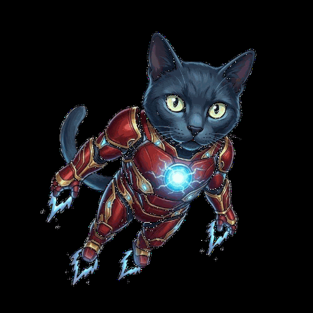
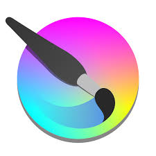

 

Aliando hardware e software pra transformar ideias em coisas que funcionam de verdade, seja um sistema web, um circuito na protoboard ou um microcontrolador ganhando vida às 2h da manhã.

 

---

## ⚙️ Tech Stack

<table>
  <thead>
    <tr>
      <th>Hardware & Backend</th>
      <th>Frontend & Design</th>
      <th>Ferramentas / Outros</th>
    </tr>
  </thead>
  <tbody>
    <tr>
      <td align="center">
        
        
        
      </td>
      <td align="center">
        
        
        
        
        
      </td>
      <td align="center">
        
        
        
        
      </td>
    </tr>
  </tbody>
</table>

---

## 🚀 Meus Projetos

<table>
  <thead>
    <tr>
      <th>Projeto</th>
      <th>Descrição</th>
      <th>Tech Stack</th>
    </tr>
  </thead>
  <tbody>
    <tr>
      <td><a href="https://github.com/IasminMoreira/uc1Cuna"><strong>🌿 Cuna</strong></a> · <a href="https://cuna-lime.vercel.app/">▶ Demo</a></td>
      <td>Plataforma que une educação ambiental, ação urbana e bem-estar natural — conectando pessoas à flora nativa da Mata Atlântica.</td>
      <td>HTML5, CSS3, JavaScript</td>
    </tr>
  </tbody>
</table>

---

## 🤝 Contribuições Estudantis

- 📍 **Ponto Focal no PROA/Senac** — faço a ponte entre a turma e a coordenação do programa. Organizo, mediei e apareço quando precisam.
- 💡 **Mentora de Eletrônica e Hardware** — ajudo colegas que travam na lógica de circuitos, na montagem com microcontroladores ou quando o sensor simplesmente não quer funcionar.
- 🐱 **Stark** continua de olho em tudo por aqui. Fiel escudeiro, crítico severo de código e especialista em dormir em cima do teclado.

---

## 🕹️ Minhas Contribuições

<picture>
  <source media="(prefers-color-scheme: dark)" srcset="https://raw.githubusercontent.com/IasminMoreira/IasminMoreira/output/pacman-contribution-graph-dark.svg"/>
  <source media="(prefers-color-scheme: light)" srcset="https://raw.githubusercontent.com/IasminMoreira/IasminMoreira/output/pacman-contribution-graph.svg"/>
  
</picture>

---

&nbsp;

  

se funcionou, não mexa. se quebrou, chama a Iasmin. 🔩

